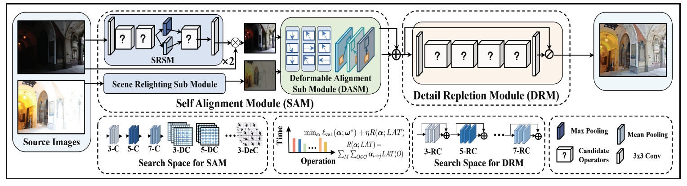

# CRMEF
Searching a Compact Architecture for Robust Multi-Exposure Image Fusion
## Preview of CRMEF
---

---
### General MEF


### Misalgined MEF

## Set Up on Your Own Machine

### Virtual Environment

+ pytorch 1.2


### Test / Train
```shell
# Test: use given example and save fused color images to result/SICE
# If you want to test the custom data, please modify the file path in 'test.py'
python test_single.py

# if you want to test the alignment
cd DCNv2
sh make.sh
python test_align.py

# Train: 
python train.py
```

## Citation

If this work has been helpful to you, we would appreciate it if you could cite our paper! 

```
@article{liu2023embracing,
  title={Searching a Compact Architecture for Robust Multi-Exposure Image Fusion},
  author={Liu, Zhu and Liu, Jinyuan and Wu, Guanyao and Chen, Zihang and Fan, Xin and Liu, Risheng},
  journal={IEEE TCSVT},
  year={2024}
}
```
